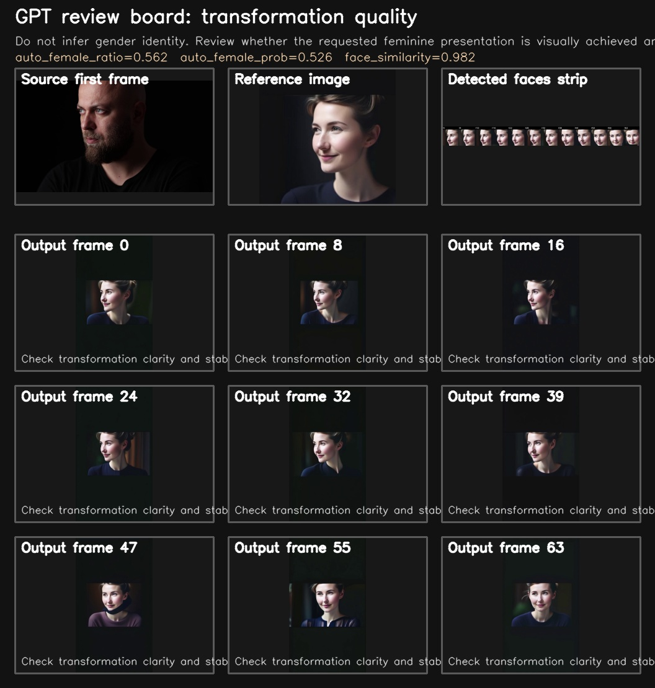
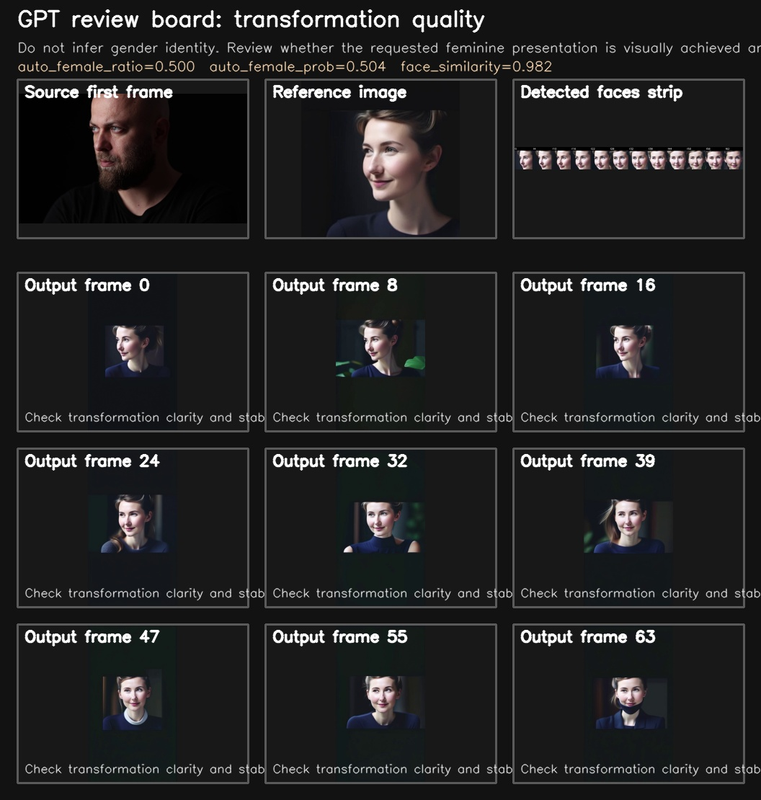
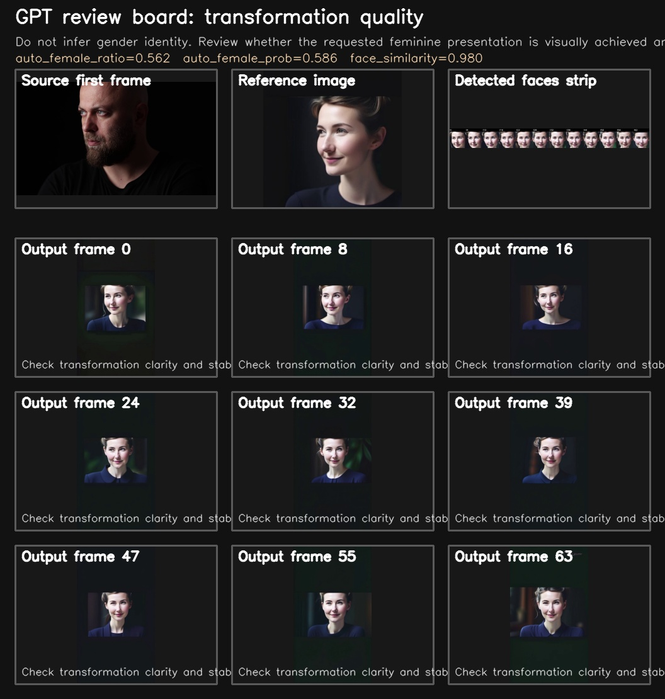
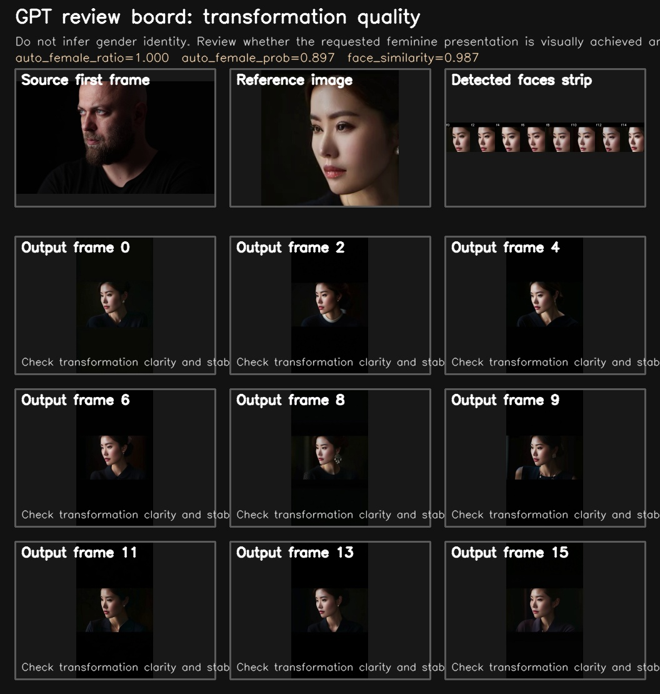

# stock-video-gender-convert

Internal workflow repo for converting stock-footage people videos with AI gender restyling and packaging them as short-form vertical clips.

## Current status

- As of `2026-03-10`, three publish-ready outputs exist:
  - `output/video/source_male_8fps_prod_v1_publish_ready.mp4`
  - `output/video/source_seg26_8fps_prod_v2_publish_ready.mp4`
  - `output/video/source_seg53_8fps_prod_v3_publish_ready.mp4`
- Subtitle burn-in, audio bed, timing notes, review artifacts, and upload metadata are already generated.
- The remaining blocker is source-license provenance for the original local clip.

## Result previews

### Clip 1

Review board: `output/review/source_male_8fps_prod_v1_review_board.jpg`

### Clip 2

Review board: `output/review/source_seg26_8fps_prod_v2_review_board.jpg`

### Clip 3

Review board: `output/review/source_seg53_8fps_prod_v3_review_board.jpg`

## Japanese early-20s probe

- Initial seed probe:
  - `output/video/source_jp_early20s_fastprobe.mp4`
  - used to bootstrap a tighter face reference from a successful transformed frame
- Improved bootstrap reference:
  - `output/reference/jp_early20s_bootstrap_ref.png`
- Current probe output:
  - `output/video/source_jp_early20s_bootstrap_probe.mp4`
- Current probe review board:
  - `output/review/source_jp_early20s_bootstrap_probe_review_board.jpg`
- This is still a cheap internal probe (`16` frames at `576x1024`) for a Japanese / early-20s visual direction.
- Auto metrics:
  - `female_ratio=1.000`
  - `female_prob_mean=0.897`
  - `face_similarity_mean=0.987`
- Current result: `pending_gpt_review`
  - the main target metrics now pass
  - the remaining QC issue is a conservative `multi_face_ratio=0.125`

## Source provenance note

- The local source files are:
  - `/media/sasaki/aiueo/ai_coding_ws/ComfyUI/input/source.mp4`
  - `/media/sasaki/aiueo/ai_coding_ws/ComfyUI/input/source_male.mp4`
- These two files are byte-identical copies of the same source clip.
- The strongest current source candidate is the Pixabay asset below:
  - `https://pixabay.com/videos/man-young-beard-bald-person-light-62553/`
  - creator: `Engin_Akyurt`
- This match is based on subject similarity, `3840x2160` resolution match, and timing proximity to the embedded local MP4 `creation_time`.
- This is still an inference, not proven provenance. No saved download URL, receipt, or browser download record has been recovered yet.

Because this repository is private, this note is kept here as an internal tracking record. Do not treat the three outputs as externally publishable until provenance is confirmed.

## Main docs

- `PLAN.md`
- `output/edit_status.md`
- `output/license/probable_source_candidate.md`
- `output/license/manual_verification_blocker.md`
